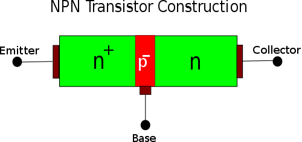
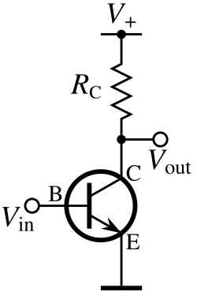

# 理論Wiki（改）品質ルールブック
<!-- last updated: 2026-04-28 | session: トランジスタ5.2 学習者UX再評価から RULE-02改訂 + RULE-39/40/41 追加 -->

このファイルは「理論Wiki（改）」の執筆・移植・レビューで守るべきルールを定義する。
別セッション開始時に Claude に「RIRON-WIKI-RULES.md を読んで」と伝えるだけで即戦力になる。

---

## RULE-00 Wiki 役割分担定義（最優先）

2つの理論 Wiki は **役割が異なる**。混在・混同禁止。

| | 理論Wiki（旧） | 理論Wiki（改） |
|---|---|---|
| URL | https://kfurufuru.github.io/denken-wiki-riron/ | file:///C:/Users/kfuru/.secretary/denken3-riron-wiki.html |
| 基盤 | MkDocs + GitHub Pages | 単一 HTML（JSX in JS） |
| 役割 | 公開・SEO・外部共有用 | 実験・高速改修・本命コンテンツ |
| 正本 | ❌ 旧は参照元 | ✅ **改が正本** |
| 移植方向 | 旧 → 改（一方向） | — |

**編集ルール**
- コンテンツ追加・改修は**すべて「改」に対して行う**
- 「旧」は過去問マッピングなどレガシー参照用として保持するが、新規コンテンツは書かない
- 「どちらに書くべきか」迷ったら常に「改」

---

## 標準ページ構成（セクション順）

```
【ページ冒頭】
PageHeader（タイトルを最上位に配置: RULE-01）
MetaStrip / LearningMap
  ↓ importance A以上・★★★以上の複合分野のみ
3段階構造パネル（学習連鎖: 任意。RULE-38参照）
Crumbs
  ↓ importance A以上・★★★以上の複合分野のみ
0. 全体像      id="overview"      （条件付き必須: RULE-34）
  ↓
§原理           id="principle"     （必須）
§公式           id="formulas"      （必須）
§比較           id="comparison"    （必須）
§実務           id="practical"     （比較の直後、例題の直前）
§例題           id="examples"      （必須）
§引っかけ       id="traps"         （必須・wisdom フィールドで自己診断統合: RULE-05）
§出題実績       id="exam-history"  （必須）
§テーマ固有セクション               （任意：半導体=ホール効果など）
  ↓ importance A以上のみ
最小暗記セット  id="minimum-set"   （条件付き必須: RULE-35）※§なし
用語集          id="glossary"      （条件付き必須: RULE-37）※§なし
PageNav
```

**注**: §プレフィックスは「最小暗記セット」「用語集」「0. 全体像」には付けない（RULE-34/35/37 参照）。

---

## RULE-01 ページヘッダー構成（順番固定）

**PageHeader を最上位に配置**する（学習者がページを開いた瞬間にテーマ名を確認できるようにするため）。

```jsx
<PageHeader
  eyebrow="X.Y — 日本語フルネーム（ABBREVIATION）"
  title="テーマ名（短い日本語）"
  deck="1〜2行の核心をつく説明文。"
  meta={[
    { label: "重要度", value: "A" },
    { label: "出題頻度", value: "高（毎年1問、問XX）" },
    { label: "難易度", value: "★★★" },
  ]}
/>
<MetaStrip difficulty="★★★" importance="A" frequency="中" />
<LearningMap
  prereqs={[{id:"xxx", title:"前提テーマ"}]}
  current="テーマ名"
  nexts={[{id:"yyy", title:"次テーマ"}]}
  onNav={onNav}
/>
<Crumbs items={[{id:"home",label:"ホーム"},{label:"X. 章名"}]} onNav={onNav} />
```

**eyebrow 書式**: `"X.Y — 日本語フルネーム（略称）"` の形式。略称だけを書かない。
- ✅ `"5.2 — バイポーラ接合型（BJT）・電界効果型（FET）"`
- ❌ `"5.2 — BJT/FET"` （日本語フルネームなし）

**importance ランク基準**（reference_denken_importance_rule.md 準拠）
- S: 毎年複数問・配点高・計算必須
- A: 毎年1問以上・絶対落とせない
- B: 隔年出題・余裕があれば
- C: 稀・時間があれば

---

## RULE-02 原理セクション「5秒で思い出す」必須＋物理メカニズムCallout（順序固定）

**順序固定**: `<Analogy>` → `<Callout variant="note" title="なぜ〜が起きるか（物理メカニズム）">`（任意） → `<Callout variant="tip" title="5秒で思い出す">` → `<p>原理補足</p>`

**物理メカニズムCalloutの位置**: アナロジー（直感的入口）の直後・「5秒で思い出す」（凝縮）の直前に配置する。
- 理由：因果（なぜそうなるか）→ 凝縮（試験当日の想起）の認知順序が学習効率を最大化する
- 「5秒で思い出す」が物理説明より先に来ると、初学者の脳に「公式リスト」が骨格化されてしまい因果理解が後回しになる（池谷脳科学・知見集約）

**物理メカニズムCalloutの追加条件**:
- アナロジーだけでは因果が腹落ちしない複合分野（トランジスタ・電磁誘導・PN接合等）で必須
- 純粋な定義テーマ（オームの法則・キルヒホッフ則）では省略可

```jsx
<h2 id="principle"><span className="h-num">1.</span>原理（なぜ起きるか）</h2>
<Analogy type="xxx" icon="🔧">
  アナロジー説明文（直感的入口）
</Analogy>
<Callout variant="note" title="なぜ○○が起きるか（物理メカニズム）">
  物理的な因果説明（材料・電子・場の物理から導く）。前章テーマからの引き継ぎを明示。
</Callout>
<Callout variant="tip" title="5秒で思い出す">
  ○○ ＝ ○○の「○○」。○○ ＝ ○○。（具体的に1〜2行・marker付き）
</Callout>
<p>原理の補足説明文（次セクションへの導線）</p>
```

**禁止**:
- 「5秒で思い出す」を物理メカニズムCalloutより先に置くこと（因果と凝縮の順序逆転）
- 物理メカニズムCalloutを「5秒で思い出す」より長文化して主役を奪うこと（補足の役割を超えない）

---

## RULE-03 公式テーブル：レイヤーA／B を H3 で明示分割

```jsx
<h2 id="formulas"><span className="h-num">2.</span>公式</h2>
<h3>レイヤーA：基本概念</h3>
<FormulaTable layer="A" rows={[
  { formula: "...", meaning: "...", when: "...", notWhen: "..." },
]} />

<h3>レイヤーB：応用変換</h3>
<FormulaTable layer="B" rows={[
  { formula: "...", meaning: "...", when: "...", notWhen: "..." },
]} />
```

`layer="A"` プロパティだけでなく H3 の「レイヤーA：基本概念」テキストも必ず書く。
視覚的に「ここまでは基本・ここから応用」とわかる分割が目的。

---

## RULE-04 実務セクション（比較表の直後・例題の直前）

**位置**：`<h2 id="comparison">` セクションの最後の要素の直後、`<h2 id="examples">` の直前。

```jsx
<h2 id="practical"><span className="h-num">実務</span>実務でどう活きる</h2>
<Callout variant="tip" title="プラント電気・計装での使われどころ">
  （導入文1〜2行：「○○は○○の現場で○○に使われる」の形式）
</Callout>
<table className="data-table">
  <thead>
    <tr><th>現場シーン</th><th>効いている物理</th><th>技術者の判断</th></tr>
  </thead>
  <tbody>
    <tr><td>具体シーン</td><td>関係する物理法則</td><td>現場技術者の具体判断・行動</td></tr>
    {/* 3行固定 */}
  </tbody>
</table>
```

**コンテンツ原則**（feedback_denken_content_rules.md 準拠）
- 固有のエピソード・個人名は禁止。一般的なプラント電気・計装シーンで書く。
- 計算式は使わず、因果の言語化で書く（「○○すると○○になる」の形式）。

---

## RULE-05 引っかけポイント：TrapBlock 4層構造（正解→誤解→判別→正答者の頭の中）

**why**: 旧 `Callout variant="warn"` は誤解をタイトルに置く構造のため、誤情報優位効果（先に読んだ誤情報が記憶に焼き付く現象）で逆効果になっていた。`<TrapBlock>` は「正解を最上段で先に脳に刻む → 誤解は補足扱い → 行動知識（判別ステップ）→ 自己診断（正答者の頭の中）」の順で、処方箋（具体手順）と診断（メタ認知パターン）を1ブロックで完結させる。これにより独立した「正答者vs誤答者」セクションは不要となる（旧 RULE-06 廃止）。

```jsx
<h2 id="traps"><span className="h-num">§5</span>引っかけポイント</h2>

<TrapBlock
  correct="1文で正しい原則を断定。学習者が最初に読む内容。"
  trap="誤解パターンを1文で。補足扱いなので長く書かない。"
  steps={[
    "判別の第1ステップ（観察・特定）",
    "判別の第2ステップ（条件判定）",
    "判別の第3ステップ（結論）",
  ]}
  wisdom="正答者が瞬時に行うメタ認知パターンを1〜2文で。「○○と○○の違いを即座に切り分け」「最初に○○を宣言してブレを防ぐ」のような自己診断軸"
  cite="R07上・H25 出題"
/>
```

**4フィールドの役割（重複禁止）**

| フィールド | 役割 | 形式 |
|---|---|---|
| `correct` | 処方箋の頭出し（正しい原則） | 断定1文 |
| `trap` | 誤解の補足（なぜ間違えるか） | 1文・italic 表示 |
| `steps` | 処方箋の手順（試験で何をするか） | 3〜4ステップ |
| `wisdom` | 診断（正答者の思考パターン・自己採点軸） | 1〜2文。具体的なメタ認知言語 |

**必須要件**
- 1ページに最低3〜5個（`wisdom` も全TrapBlockで必須）
- 過去問で実際に誤答を誘う選択肢が使われたものを優先
- `cite` には出題年度を必ず記載（マーカー要件 RULE-14 と連動）
- `steps` は3〜4個。手順化された行動知識にする（「○○を確認 → ○○なら○○」形式）
- `wisdom` は **steps とは異なる粒度**で書く（steps=具体操作、wisdom=思考パターン）

**禁止**
- 旧 `<Callout variant="warn" title="勘違い①：...">` 構造の新規追加
- `correct` に複数文を詰め込むこと（1文厳守）
- `trap` に「なぜ間違えるか」の長文解説を入れること（→ `steps` で吸収）
- `wisdom` を `steps` の要約だけにすること（→ メタ認知レベルの言語化が必須）
- 旧「§6 正答者 vs 誤答者」テーブルの新規追加（廃止済み・wisdom フィールドに統合）

---

## RULE-06 【廃止】正答者 vs 誤答者テーブル → TrapBlock の `wisdom` に統合

**廃止理由**: 旧 RULE-06 のテーブルと RULE-05 の TrapBlock で内容重複が頻発（同じ誤解パターンが両所に現れる）。役割の境界線が抽象的で執筆者が判断に迷う問題があった。

**新運用**: TrapBlock に `wisdom`（正答者の頭の中）フィールドを追加し、各引っかけと対になる「正答者の思考パターン」を同じブロック内に配置する。これにより構造的に重複が発生しなくなる。

- 既存ページの `<h2 id="correct-vs-wrong">` セクションは順次削除し、その内容は対応する TrapBlock の `wisdom` フィールドに移植する。
- 移植時に対応する TrapBlock がない誤解パターンは新規 TrapBlock を作成する（テーブル1行 → 1 TrapBlock の対応関係を維持）。
- 詳細は RULE-05 を参照。

**禁止**
- 新規ページに `id="correct-vs-wrong"` テーブルを追加すること
- TrapBlock の `wisdom` を空にして、別途比較テーブルを作ること

---

## RULE-07 出題実績テーブル：H18以降を4列で記載

```jsx
<h2 id="exam-history"><span className="h-num">7.</span>出題実績</h2>
<table className="data-table">
  <thead>
    <tr><th>年度</th><th>問</th><th>形式</th><th>何が問われたか</th></tr>
  </thead>
  <tbody>
    <tr><td>R07上</td><td>問XX</td><td>穴埋 or 論説</td><td>出題内容の要約</td></tr>
    {/* H18〜最新まで */}
  </tbody>
</table>
```

テーブル直後に出題頻度サマリを1行添える：
```jsx
<p>→ 出題頻度: ★★★★（毎年度1問、問XXに固定）</p>
```

---

## RULE-08 Callout variant の使い分け

| variant | 用途 | 表示スタイル |
|---|---|---|
| `tip` | 「5秒で思い出す」「実務での使われどころ」「覚え方」 | 緑系 |
| `warn` | 引っかけポイント・よくある勘違い | 黄/橙系 |
| `note` | 補足説明・出題実績メモ・判断手順 | 青系 |
| `info` | Level 3 実務との接点 | 灰系 |

---

## RULE-09 admonition の畳み方（feedback_admonition_visibility.md 準拠）

- **常時表示**（`!!!` 相当 = JSXで直接記述）：説明コンテンツ・引っかけ・実務
- **折りたたみ**（`details` タグ）：quiz解答・Level 2/3 数学的補足

```jsx
{/* 常時表示 */}
<Callout variant="note" title="タイトル">内容</Callout>

{/* 折りたたみ（例題解答） */}
<details>
  <summary>解答</summary>
  <p>...</p>
</details>
```

---

## RULE-10 ページフッター：PageNav 必須

```jsx
<PageNav
  prev={{id:"xxx", title:"X.X テーマ名"}}
  next={{id:"yyy", title:"Y.Y テーマ名"}}
  onNav={onNav}
/>
```

---

## RULE-11 JSX エスケープ規則

```jsx
// NG: <, > をそのまま使う
<td>VL > VP → 順バイアス</td>

// OK: JSX エスケープ
<td>VL {'>'} VP → 順バイアス</td>
<td>アノード電位 {'<'} カソード電位</td>
```

数式は `<Eq tex="..." />` コンポーネントを使う（文字列としてテキスト中に書かない）。

---

## RULE-12 比較セクション（§比較）の形式

**位置**：`<h2 id="comparison">` — 公式セクションの直後、実務セクションの直前。

```jsx
<h2 id="comparison"><span className="h-num">3.</span>比較・整理</h2>
<table className="data-table">
  <thead>
    <tr>
      <th>観点</th>
      <th>A（例：N型）</th>
      <th>B（例：P型）</th>
      {/* 候補が3つ以上の場合はC列を追加 */}
    </tr>
  </thead>
  <tbody>
    <tr>
      <td>観点名（キャリア・温度特性 等）</td>
      <td>Aの特徴</td>
      <td>Bの特徴</td>
    </tr>
    {/* 最低4行 */}
  </tbody>
</table>
```

**列構成ルール**
- 第1列「観点」は学習者が混同しやすい軸を選ぶ（過去問頻出の比較軸を優先）
- 比較候補が2つ：A / B の2列構成
- 比較候補が3〜4つ：3〜4列構成（列幅 `style={{width:"22%"}}` 等で均等化）
- セル内に過去問で問われた語句があれば `<span className="marker">` を付与（RULE-14）

---

## RULE-13 例題セクション（§例題）の構造

**位置**：`<h2 id="examples">` — 比較セクションの直後、引っかけの直前。

```jsx
<h2 id="examples"><span className="h-num">4.</span>例題</h2>

{/* 例題ブロック（1問ずつ繰り返し） */}
<Callout variant="note" title="例題X：問題文タイトル（出題年度があれば記載）">
  （問題文。選択肢形式 or 穴埋め形式で提示）
</Callout>

<details>
  <summary>解答・解説</summary>
  <p>ステップ①：…</p>
  <p>ステップ②：…</p>
  <p><strong>答え：選択肢X</strong></p>
</details>

<Callout variant="tip" title="この例題のツボ">
  1〜2行で「なぜその答えか」の核心を言い切る。
</Callout>
```

**構造ルール**
- 順序固定：「問題文Callout → details折りたたみ解答 → tipツボ」
- `<details>` はスマホ表示を必ず確認してから採用（長い解説の場合のみ折りたたみ）
- 例題は最低2問、理想3〜5問（過去問の実出題を含める）
- 過去問からの引用は `title="例題X：… (R04 問XX)"` のように年度・問番号を明記

---

## RULE-14 過去問出題箇所はマーカーでハイライト

**why**: 学習者は「どこが過去問で問われたか」を一目で識別したい。出題された具体フレーズに `<span className="marker">` を付与することで、表・本文の中でも視覚的にスキャンできる。直前期の総ざらいで効率が劇的に上がる。

```jsx
{/* 表セル内 */}
<td><span className="marker">正孔が偏った側が高電位（＋）</span></td>

{/* Callout 本文内 */}
<Callout variant="note" title="バラクタダイオードの原理（R02 出題）">
  <span className="marker">逆バイアス電圧 V_R を大きくするほど空乏層が広がり、静電容量 C が小さくなる</span>。
</Callout>
```

**マーキング基準**
- 過去問の選択肢・穴埋め解答で**そのまま正答キーワードとして問われた語句**のみ
- 一般説明文・前提知識・導入文には付けない（マーカーが多すぎると無効化）
- 1ページあたり目安 5〜15箇所（少なすぎても効果なし、多すぎても識別性低下）
- マーキングした箇所には可能な限り `cite` 情報（出題年度）を近くに併記

**`marker` クラス挙動**（既存CSS）
- ライトモード: 黄色（`oklch(0.92 0.18 95)`）の下半分グラデーション
- ダークモード: 黄色の半透明（`oklch(0.55 0.16 95 / 0.55)`）

---

## RULE-15 テーブルは className="data-table" を必須化

**why**: プレーン `<table>` だとボーダー・ヘッダー背景・ストライプが適用されず、画像で確認した通り「表が見にくい」状態になる。CSS は `table.data` / `table.data-table` / `.content table` の3パターンに対応しているが、**新規追加は `className="data-table"` で統一**する。

```jsx
{/* OK */}
<table className="data-table">
  <thead>
    <tr><th>項目</th><th>N型</th><th>P型</th></tr>
  </thead>
  <tbody>
    <tr><td>...</td><td>...</td><td>...</td></tr>
  </tbody>
</table>

{/* NG: クラスなし */}
<table>
  <thead>...</thead>
</table>
```

**ヘッダー必須**
- `<thead>` を必ず置く（背景色・太字を効かせるため）
- 列数が多い場合は `style={{width:"XX%"}}` で列幅を明示

---

## RULE-16 カラーポリシー：背景色禁止・黄色マーカーのみ許可

**why**: 色付き背景（Callout tip の緑・warn の amber・Analogy の緑・TrapBlock の緑/amber）は学習集中を妨げ、視覚的ノイズになる。**背景色は禁止**。重点箇所の強調は黄色マーカー（`.marker`）のみで行う。

### 背景色ルール（最重要）

| 要素 | 背景色 | 禁止 |
|---|---|---|
| Callout（全variant: tip/warn/info/note） | `var(--bg-elev)` | `-soft` 系背景（緑・amber・青）禁止 |
| TrapBlock（正解・誤解・判別ステップ） | `var(--bg-elev)` | `--ok-soft` / `--warn-soft` 背景禁止 |
| Analogy | `var(--bg-elev)` | `--ok-soft` 背景禁止 |
| FormulaTable 層バッジ | `var(--bg-sunken)` | `-soft` 系背景禁止 |
| **`.marker` スパン** | **黄色グラデ（oklch 0.92 0.18 95）** | **唯一許可された色付き背景** |

### セマンティクスの伝達方法

背景色を使わずセマンティクスを伝えるには：
- **アイコン**: ✅ ⚠ 🔍 💡 🔑（emoji で型を伝える）
- **ラベル文字色**: `--ok` / `--warn` / `--danger` / `--accent-ink`（テキストのみに色）
- **左ボーダーストライプ**: Callout の `borderLeft: "4px solid ${c.border}"` は細く目立たないため維持可

### 禁止事項

- 直接 `color: red` / `#ff0000` などのリテラル指定
- `-soft` トークンを**背景色**として使うこと（`color` プロパティへの使用は可）
- `--danger` を hue 25以下（赤系）に設定すること
- インライン `background` / `backgroundColor` への色付きトークン指定
- `<span style={{background: "var(--ok-soft)"}}>` のような個別インライン着色

---

## 移植品質チェックリスト（旧GH Pages→理論Wiki（改））

新しいページを移植・新規作成したら以下を確認する：

- [ ] **M1** MetaStrip importance が正しいランク（S/A/B/C）になっているか
- [ ] **M2** LearningMap の prereqs / nexts が接続されているか
- [ ] **M3** 「5秒で思い出す」が原理セクション末に存在するか
- [ ] **M4** 公式が「レイヤーA：基本概念」「レイヤーB：応用変換」のH3で分割されているか
- [ ] **M5** テーマ固有の重要セクション（ホール効果★★★★★等）が適切な見出しレベルになっているか
- [ ] **M6** 深掘りが必要な箇所に Level 2/3 の `<details>` 補足があるか
- [ ] **M7** ページ末に最終確認日・バージョン表記があるか（**必須**。`v1.0 | 最終確認: YYYY-MM-DD` 形式）
- [ ] **M8** 難解用語・技術記号の初出箇所に Tooltip が挿入されているか、かつ用語集（id="glossary"）に登録されているか（RULE-36・RULE-37）
- [ ] **M9** テーマ固有の補足公式・図解・計算例が網羅されているか
- [ ] **M10** 「実務でどう活きる」セクション（RULE-04）があるか
- [ ] **M11** 比較セクションが「観点×候補」の列構成になっているか（RULE-12）
- [ ] **M12** 例題が「問題Callout → details解答 → tipツボ」の順序になっているか（RULE-13）
- [ ] **M13** 過去問で問われた具体フレーズに `<span className="marker">` が付与されているか（RULE-14）
- [ ] **M14** 引っかけポイントが `<TrapBlock>` 形式になっているか（RULE-05）
- [ ] **M15** すべての表に `className="data-table"` が付いているか（RULE-15）
- [ ] **M16** 赤系リテラルカラー・hue 25以下の `--danger` 上書きが無いか（RULE-16）
- [ ] **M17** 公式の `when`（成立条件）が全行に記載されているか（RULE-20）
- [ ] **M18** 公式の `notWhen`（非成立条件 + 代替手段）が全行に記載されているか（RULE-20）
- [ ] **M19** 各例題末尾に「極端条件チェック」（支配変数0/∞）があるか（RULE-21）
- [ ] **M20** 比較テーブル末行に「支配因子」行があるか（RULE-22）
- [ ] **M21** 数値・条文ごとに根拠（物理的・法的）が添えられているか。語呂合わせを使っていないか（RULE-25）
- [ ] **M22** 形容詞・抽象論で終わるセクションがないか。各セクションが数値・具体行動・結論断定で終わっているか（RULE-26）
- [ ] **M23** 過去問引用が電験王3 URL等で確認済みか。未確認なら `[要確認]` マークがあるか（RULE-27）
- [ ] **M24** importance ランクが2軸マトリクス（出題頻度×難易度）で判定されているか。B問題1ランクUP補正が反映されているか（RULE-28）
- [ ] **M25** 各テーマで「現象→原因→構造」の3層が網羅されているか（RULE-29）
- [ ] **M26** 本文段落が3〜5行以内か。連続4段落以上で表・Calloutが挟まれているか。ネガティブで終わるセクションがないか（RULE-30）
- [ ] **M27** 用語集セクション（id="glossary"）が存在し、ページ内で初出の技術略語・記号が9語以内で登録されているか（RULE-37）
- [ ] **M28** ページ内で初出の難解語（BJT・FET・hFE・hie・gm 等）に Tooltip が挿入されているか（RULE-36）

---

## RULE-17 ページ改定日の記録

ページを追加・改修したら**必ず改定日を2箇所に記録**する。

### ① JSXコンポーネント先頭コメント（機械可読・ソース追跡用）

```jsx
const SemiconductorPage = ({ onNav }) => (
  // last-updated: 2026-04-27 | v1.0 | M1/M3/M5移植・実務セクション追加
  <>
    <MetaStrip ... />
```

書式：`// last-updated: YYYY-MM-DD | vX.X | 変更内容の要約（30字以内）`

### ② ページ末尾の表示テキスト（学習者向け・信頼度指標）

```jsx
    <PageNav prev={...} next={...} onNav={onNav} />
    <p style={{fontSize:"0.8em", color:"var(--ink-mute)", marginTop:"2rem"}}>
      最終改定: 2026-04-27 | v1.0
    </p>
  </>
);
```

### バージョン番号の意味

| バージョン | 状態 |
|---|---|
| v0.5 | 骨格のみ（公式・比較表はあるが薄い） |
| v0.7 | 構造・公式・数値検証済み（引っかけ・出題実績あり） |
| v0.9 | 実務・正答者vs誤答者・マーカー追加済み。最終確認前 |
| v1.0 | M1〜M26 チェックリスト全通過・過去問実出題との照合済み |

**ルール**
- 改修後はバージョン番号を必ず上げる（v0.7 → v0.9 など）
- v1.0 は M1〜M26 チェックリストを全て ✅ にしてから付与
- 日付だけ更新してバージョンを据え置くのは禁止

---

## RULE-18 MetaStrip パラメータ基準（difficulty・frequency）

RULE-01の `<MetaStrip>` に渡す3パラメータのうち、`difficulty` と `frequency` の判定基準を定義する。

### difficulty（難易度）★1〜4

| ★ | 基準 | 典型テーマ例 |
|---|---|---|
| ★ | 概念理解だけで解ける（計算不要・定義問題） | 半導体の種類、計器の原理 |
| ★★ | 基本計算あり・公式1本で完結 | 直流回路（オームの法則）、静電エネルギー |
| ★★★ | 複数公式の組み合わせ or 条件分岐が必要 | 交流回路（インピーダンス計算）、三相交流 |
| ★★★★ | 複雑な過渡計算・ベクトル図・複素数処理 | 過渡現象、RLC共振、ブリッジ回路 |

**★5は使用しない**（電験3種範囲を超える深掘りは本Wiki対象外）

### frequency（出題頻度）高・中・低

| 値 | 基準（優先順） |
|---|---|
| 高 | 直近3年（R05〜R07）で毎年1問以上 **または** H18以降で5回以上 |
| 中 | H18以降で2〜4回 |
| 低 | H18以降で1回以下・稀 |

**importanceとの関係**：`frequency=高` ならほぼ `importance=A or S` になる。乖離がある場合は出題実績テーブル（RULE-07）を再確認する。

---

## RULE-19 テーマ固有セクションの追加ルール

標準ページ構成末尾の「§テーマ固有セクション（任意）」を追加する条件と形式を定義する。

**追加条件**（いずれかを満たす場合）
- そのテーマ固有の概念で **difficulty ★★★以上** の内容が標準セクションに収まらない
- 過去問で繰り返し単独出題されているサブトピックがある（例：半導体のホール効果、磁気回路の磁気抵抗）

**形式**
```jsx
{/* テーマ固有セクション例 */}
<h2 id="hall-effect"><span className="h-num">★</span>ホール効果（特出し）</h2>
<MetaStrip difficulty="★★★★" importance="A" frequency="高" />
{/* セクション内容 */}
```

- 見出しは **H2固定**（H3以下にしない）
- `id` は `kebab-case` で固有名詞を使う（`hall-effect`・`magnetic-resistance` 等）
- `<span className="h-num">` の中身は `★`（番号ではなくアイコンで区別）
- テーマ固有セクションにも独自の `<MetaStrip>` を付与する（親ページと異なる難易度になりうる）
- チェックリスト M5 対象

---

## RULE-20 公式テーブル `when`/`notWhen` 必須化（成立条件・非成立条件）

**why**: 公式を「式＋意味」だけで覚えると、条件が変わった瞬間に適用ミスが起きる。`when`/`notWhen` を必須フィールドにすることで「この式が生きる世界」と「壊れる世界」を公式とセットで刻み込む。

**ターゲット**：`RULE-03` の `<FormulaTable>` rows

```jsx
// NG: when/notWhen が空または省略
{ formula: "$V = IR$", meaning: "電圧=電流×抵抗", when: "", notWhen: "" }

// OK（1条件）: 成立条件と非成立条件を1行で言語化
{
  formula: "$V = IR$",
  meaning: "電圧=電流×抵抗（電気量の翻訳）",
  when: "定常状態かつ純抵抗（リアクタンス成分なし）の場合",
  notWhen: "過渡状態・リアクタンス成分がある場合 → V=IZ を使う"
}

// OK（複数条件）: 3条件以上はリスト形式に展開
{
  formula: "$I_0 = I_1 + I_2$",
  meaning: "電流の分岐（キルヒホッフ第1法則）",
  when: (
    <ul>
      <li>定常状態（過渡成分が収束後）</li>
      <li>接続点での電荷蓄積なし</li>
      <li>キャパシタの過渡電流を除く場合</li>
    </ul>
  ),
  notWhen: "スイッチング直後の過渡期 → i(t)の微分方程式を解く"
}
```

**コンテンツ原則**
- `when` = 「この式が成立する世界」を1行（または短リスト）で宣言
- `notWhen` = 「この式が崩れる条件」＋「→ 代替手段」をセットで書く（代替手段省略禁止）
- 条件が3個以上は `<ul>` リスト形式で展開（1行に詰め込まない）
- `notWhen` に「○○の場合は成立しない」で終わるのは禁止

---

## RULE-21 極端条件チェック（支配変数 0/∞）を例題セクション末尾に追加

**why**: 極端条件で挙動を確認することで「式の意味を数値で検証できる」状態にする。支配変数が曖昧なまま極端条件を当てても意味がないため、支配変数の特定を先に行う手順を必須にする。

**ターゲット**：`RULE-13` の `<Callout variant="tip" title="この例題のツボ">` の直後

```jsx
<Callout variant="note" title="極端条件チェック">
  <p><strong>支配変数：</strong>静電容量 C（この回路の結果を最も左右する変数）</p>
  <ul>
    <li>C → <strong>0</strong>（理想コンデンサなし）のとき：充電電流が∞→直後に短絡状態と等価、実際は接触抵抗で制限される</li>
    <li>C → <strong>∞</strong>（理想的に大容量）のとき：端子電圧はほぼ一定→定電圧源と等価、充電電流は抵抗のみで決まる</li>
  </ul>
</Callout>
```

**必須フィールド**：
- `支配変数：` — 1〜2個に絞り、「この現象の結果を最も左右する変数」を1行で宣言
- `0のとき` / `∞のとき` — 挙動＋物理的意味（現場で起きること）を添える

**コンテンツ原則**
- 支配変数は先に1つ決めてから極端条件を当てる（複数の変数を同時に動かさない）
- 「結果だけ」ではなく「物理的に何が起きているか（短絡・開放・飽和 等）」を必ず添える
- 現実的に起こりえる極端ケース（ケーブル断線→R=∞、完全短絡→R=0 等）には現場での意味を明記する

---

## RULE-22 支配因子行を比較セクションの末行に必須追加

**why**: 比較表は「違いを列挙する」だけで終わりがちだが、「どの変数が性能を最も左右するか」を示さないと、設計判断に使えない。支配因子を末行に固定することで、読者が表を読み終えた直後に「核心」を受け取れる。

**ターゲット**：`RULE-12` の比較テーブル

```jsx
{/* 2列構成（例：N型 vs P型）*/}
<tr>
  <td><strong>支配因子</strong></td>
  <td colSpan={2}>
    温度 T（↑で多数キャリア数が増加し電気伝導率が上昇）。次いで不純物濃度 N_D（N型）/ N_A（P型）が支配。
    <br /><em>→ T が2倍になると導電率は非線形に増大（指数関数的）</em>
  </td>
</tr>

{/* 3列構成（例：スター結線 vs デルタ結線 vs 混合）*/}
<tr>
  <td><strong>支配因子</strong></td>
  <td>線間電圧 V_L（√3 倍の係数が主役）</td>
  <td>相電流 I_φ（線電流と等しくない点が試験の罠）</td>
  <td>設計によるが V_L / I_L の比率</td>
</tr>
```

**列数別ルール**
- 2列（A vs B）: `colSpan={2}` で支配因子を統合表示
- 3〜4列（A vs B vs C …）: 各列に個別の支配因子を書く（統合しない）

**コンテンツ原則**
- 「この現象・この式の結果を最も大きく左右する変数」を1〜2個に絞る
- 「2倍になったら結果はどう変わるか」を1行添えることを推奨（比例・指数・非線形の違いが見える）
- 複数列で支配因子が同じ場合は統合OK。異なる場合は列別に書く（混在させない）

---

## RULE-23 トップページ構成：価値ステートメント＋状態別3カード

**why**: 学習者は最初の3秒で「自分はどこへ行けばいいか」を判断する。単元一覧を直接見せると、初学者・苦手克服・直前確認の状態がすべて同じ入口を辿らされ、離脱率が上がる。トップは状態振り分けに特化し、単元一覧は下層に配置する。

### トップページの構造（順番固定）

```jsx
{/* ① 価値ステートメント（1文・誰のため・何ができる） */}
<HeroStatement
  who="電験3種・理論科目の受験者向け"
  what="理解 → 解法判断 → 過去問適用 → 直前確認まで一気通貫で支援する学習Wiki"
/>

{/* ② 状態別3カード（4枚以上に増やさない） */}
<EntryCards>
  <EntryCard
    state="zero"
    title="ゼロから始める"
    desc="第1章クーロンから順番に。学習マップで前提知識を確認しながら進める。"
    cta="第1章へ"
    onNav={() => onNav("coulomb-field")}
  />
  <EntryCard
    state="weakness"
    title="苦手を潰す・過去問逆引き"
    desc="出題傾向データから自分の弱点単元を特定。引っかけパターン37個でケアレスミスを根絶。"
    cta="出題傾向を見る"
    onNav={() => onNav("trends")}
  />
  <EntryCard
    state="last3days"
    title="直前3日で仕上げる"
    desc="重要度S/Aの公式と引っかけだけを5秒要約で総ざらい。"
    cta="直前3日戦略へ"
    onNav={() => onNav("last-3days")}
  />
</EntryCards>

{/* ③ 単元一覧（既存。状態別カードの下に配置） */}
<ChapterList chapters={data.chapters} onNav={onNav} />

{/* ④ リファレンス導線（公式集・用語集・パターン集） */}
<ReferenceLinks />
```

**コンテンツ原則**
- 価値ステートメントは「誰のため」「何ができる」を**1文で言い切る**。長文NG
- 状態カードは**3枚固定**。4枚以上に増やすと選択コストが上がり離脱要因になる
- 各カードは `title` + `desc`（30字以内）+ `cta`（行動ボタン）の3点セット
- カードクリックで該当ページに直接遷移する（中間ページを挟まない）

**禁止**
- 状態カードを4枚以上に増やす
- 単元一覧をトップ最上部に配置する（旧構造）
- 価値ステートメントを「ようこそ」「学習サイトです」のような中身のない文にする

---

## RULE-24 ライター向け禁止事項5箇条（メタルール）

**why**: ルールが22本に膨れた今、「やってはいけないこと」を散在させると新規ライターが迷う。否定形のメタルールとして5箇条に集約し、書き始める前のセルフチェックに使う。

### 5箇条

```
❌ 1. 公式だけのページを作らない
   → 必ず「原理 → 公式」の順。RULE-02（5秒で思い出す）と RULE-03 を守る

❌ 2. 比較なしに似た概念を単独で説明しない
   → 似た概念が2つ以上出たら必ず比較表。RULE-12 と RULE-22（支配因子）を守る

❌ 3. 長文だけで説明しない
   → 3段落連続したら必ず表・Callout・FormulaCard・TrapBlock のいずれかを挟む

❌ 4. 過去問との接続がないページを作らない
   → RULE-07（出題実績）と RULE-14（マーカー）を最低1件ずつ守る

❌ 5. AI生成の未検証情報を v1.0 として扱わない
   → RULE-17 のバージョン体系を守る。v1.0 は M1〜M20 全通過後のみ
```

### 適用タイミング

- ページ新規作成前：5箇条をセルフチェック
- ページ改修時：違反していないか再確認
- レビュー時：レビュアーが5箇条で機械的にチェック

**コンテンツ原則**
- 違反を1つでも検出したら、そのページは v1.0 を付与してはならない
- 5箇条は不変。新規ルールが増えても5箇条には統合せず、個別RULEとして追加する
- 5箇条の文言を変更する場合は CHANGELOG に明記

---

## RULE-25 数値・条文の根拠提示必須（語呂合わせ禁止）

**why**: 数値（電圧値・電流値・条文番号・閾値）を「丸暗記対象」として提示すると、試験本番で類似数値と混同する。「なぜその値か」の物理的・法的根拠を添えることで、深い処理（Deep Processing）が起きて記憶定着率が2倍以上に上がる（認知心理学）。語呂合わせは因果理解を阻害するため使用禁止。

### 必須フォーマット

```jsx
// NG: 数値だけ提示
<p>低圧の上限は交流600V、直流750V。</p>

// OK: 根拠とセットで提示
<p>低圧の上限は<strong>交流600V・直流750V</strong>。
   <em>（直流のほうが大きい理由：直流は電流が一定なのに対し、交流は実効値の√2倍の最大値が瞬間的に印加されるため、同じ絶縁設計なら直流のほうが高い電圧まで許容できる）</em></p>

// OK: 公式テーブルでwhen列に根拠
{ formula: "$V = 100/\\sqrt{3}$",
  meaning: "相電圧（Y結線）",
  when: "線間電圧100V・対称三相のとき。√3は3相間の幾何平均から導出" }
```

**コンテンツ原則**
- 数値を出すときは必ず「なぜその値か」を1文で添える
- 物理的根拠（材質・物性・公式由来）または法的根拠（条文・規定の趣旨）を明記
- 「覚えるべき数値」リストは作らない。「導出できる数値」として扱う

**禁止**
- 語呂合わせ（「ロクシマル＝600V」など）の使用
- 数値だけを羅列したリスト・表（根拠列なし）
- 「とにかく覚える」「丸暗記」という指示語

---

## RULE-26 抽象論禁止・形容詞で終わらない

**why**: 「重要です」「検討が必要です」「興味深い」などの形容詞・抽象表現は具体的な学習行動に結びつかない。学習者は「で、結局何をすればいいのか」が分からず、ページを読んでも記憶に残らない。具体性勾配理論（concrete > abstract）に従い、必ず数値・具体例・具体的な行動指示で終わる。

### 違反例と修正例

```
❌ 違反: 「電界の理解は重要です」
✅ 修正: 「電界 E は q×E で力が働く。点電荷から距離 r では E=kQ/r²。試験では『電位 V との混同』で1点失う」

❌ 違反: 「比較表を見て理解しましょう」
✅ 修正: 「比較表で『静電容量とインダクタンスの双対性』を確認 → 例題3 で計算 → 引っかけ#5 でケアレスミス防止」

❌ 違反: 「過渡現象は試験で頻出です」
✅ 修正: 「過渡現象は H22以降で計算問題6回・穴埋4回出題。RC直列回路の時定数 τ=RC が問われる確率が約60%」
```

**禁止する表現リスト**
- 「重要です」「大切です」「必要です」（形容詞だけ）
- 「興味深い」「面白い」（学習動機にならない）
- 「検討が必要」「考慮すべき」（行動が定義されていない）
- 「〜について理解しましょう」「〜を学びましょう」（学習者への丸投げ）

**必須の終わり方**
- 数値で終わる（「H25問4で出題」「正答率42%」）
- 具体的行動で終わる（「→ 例題3で計算 → 引っかけ#5を確認」）
- 結論断定で終わる（「∴ 直流のほうが高い」「∴ 開放と等価」）

---

## RULE-27 過去問引用時の出典検証（推測タイトル禁止）

**why**: 過去問の引用が AI 推測ベースだと、学習者が誤った年度・問番号・出題内容を記憶してしまう。最大の脅威は「実在しない出題セクション」を作ってしまうこと。電験王3 等の信頼できる一次ソースで実在を確認するプロセスを必須化する。

### 引用時の検証手順（3段階）

**段階1: 出典URL確認**
```
電験王3 URL形式:
- R04〜R07: https://denken-ou.com/{科目}r{N}-{1|2}-{問番号}/
  例: https://denken-ou.com/rironr07-1-04/
- R01〜R03: https://denken-ou.com/{科目}r{N}-{問番号}/
  例: https://denken-ou.com/rironr03-04/
- 科目prefix: riron（理論）/ denryoku（電力）/ kikai（機械）/ houki（法規）
```

**段階2: 内容照合**
- 引用しようとする出題内容と、URL先の実際の問題文・選択肢を照合
- 数値・選択肢・問われている概念が一致するか確認

**段階3: 信頼度マーク**
- ✅ 確認済み: そのまま `cite="R07上 問04"` として記載
- ⚠️ 不確実: `cite="R07上 問04 [要確認]"` のようにマーク
- ❌ 推測のみ: 引用を削除、または `cite="類似出題あり（年度未確認）"` に変更

**禁止**
- 出典確認なしで「H25問4」「R05問11」のような具体年度を記載すること
- 「過去問頻出」のような曖昧表現を出典として扱うこと
- AI生成時に「それっぽい年度」を生成して入れること

**マーカー連動**
- RULE-14 の `<span className="marker">` を付与する場合は、出典確認済みの実フレーズに限定する

---

## RULE-28 重要度判定の2軸マトリクス（出題頻度×難易度）

**why**: RULE-01 で `importance="A"` のような値を設定するが、判定基準が曖昧だと書き手によって振れる。「出題頻度×難易度」の2軸マトリクスで機械的に判定する基準を明示し、誰が書いても同じランクが出るようにする。

### 判定マトリクス

| 出題頻度 \\ 難易度 | ★（基礎） | ★★（標準） | ★★★（複合） | ★★★★（応用） |
|---|---|---|---|---|
| **超頻出（毎年複数問）** | A | S | S | S |
| **頻出（毎年1問以上）** | B | A | A | S |
| **隔年（H18以降5回前後）** | C | B | A | A |
| **稀（H18以降1〜2回）** | C | C | B | B |
| **未出題** | — | C | C | B |

### B問題1ランクUP補正

**why**: B問題（複合問題・配点高）で出題されたものは、A問題で出題されたものより試験戦略上の重みが大きい。同じ出題頻度・難易度でも1ランク上げる。

```
判定例:
- 「直流回路」: 超頻出 × ★★ → S（B問題出題実績ありなら S確定）
- 「過渡現象」: 頻出 × ★★★★ → S
- 「ホール効果」: 稀 × ★★★ → B
- 「太陽電池」: 未出題 × ★★ → C
```

### 振れ幅の検証

新ページ作成時は **judging-table.md（任意）** または各科目の出題傾向データ（`/trends`）と照合し、判定が他テーマと一貫しているか確認する。

**禁止**
- 「主観的に重要だと思うから A」のような根拠なき判定
- マトリクス外の独自判定（D・E・特Sなどの追加）
- 出題実績データを参照せずに判定すること

---

## RULE-29 解説深度基準：3層必須（現象→原因→構造）

**why**: 構造把握力（kozo-haaku-ryoku.md）の4層分解（現象→原因→構造→打ち手）のうち、**最低3層（現象→原因→構造）まで届かせる**ことを必須化。「現象しか書いていない」「公式だけ羅列」のページを排除する。打ち手層は試験範囲を超える場合があるため任意。

### 3層の到達基準

| 層 | 到達基準 | NG例 | OK例 |
|---|---|---|---|
| **① 現象** | 何が起きているか・観測される事象 | 「コンデンサは電気をためる」 | 「コンデンサは電圧をかけると電荷を蓄積し、外すと放出する」 |
| **② 原因** | なぜそれが起きるか・物理的メカニズム | （層①で止まる） | 「電界が誘電体内の双極子を整列させ、極板間に電位差を生む」 |
| **③ 構造** | それを生む仕組み・支配する変数 | （層②で止まる） | 「Q=CVで決まる。C は ε（誘電率）×S（面積）/ d（距離）に比例。誘電体・面積・距離の3変数が支配因子」 |
| ④ 打ち手（任意） | どこを変えると全体が動くか | — | 「設計現場では誘電体選定で C を最大化、距離 d を最小化（耐圧との両立）」 |

### 必須セクションへの適用

- **§原理（principle）**: 層①〜②（現象＋原因）必須
- **§比較（comparison）**: 層③（支配因子）必須 → RULE-22 の支配因子行と一致
- **§実務（practical）**: 層④（打ち手）に相当 → RULE-04 で実装

### 検証質問（書き手のセルフチェック）

```
このページは以下の質問に答えているか？
- ✅ 何が起きるか（現象）
- ✅ なぜ起きるか（原因）
- ✅ どの変数が結果を支配するか（構造）
- 任意: どこを変えると全体が動くか（打ち手）
```

**禁止**
- 現象だけのページ（公式羅列のみ・「○○は××である」のみ）
- 原因だけのページ（メカニズム解説のみで現象や支配因子なし）
- 「打ち手」を試験範囲外で無理に書くこと

---

## RULE-30 スマホ最適化：セクション3〜5行・ポジティブトーン

**why**: 学習者はバス通勤中・スキマ時間にスマホで読む。長文段落が連続するとスクロールが必要になり、認知負荷理論の Sweet Spot（一度に処理できる情報単位）を超えて記憶定着率が下がる。ポジティブトーン維持で離脱率を低減する。

### 段落・セクションの長さ基準

| 単位 | 行数の目安 | 違反時の対応 |
|---|---|---|
| **本文段落** | 1段落 3〜5行（スマホ表示で1画面以内） | 6行以上 → 表・Callout・FormulaCard で分割 |
| **連続段落** | 同一セクション内で本文段落は最大3つまで | 4つ目を書く前に必ず表・コンポーネントを挟む |
| **セクション全体** | スマホ縦スクロール3〜4画面以内 | 超える場合はサブ見出し（H3）で分割 |

### トーンの基準

```
❌ ネガティブ: 「これを覚えていないと試験で間違える」「難しいので注意」
✅ ニュートラル: 「この公式は H25問4 で出題された」
✅ ポジティブ: 「ここが分かれば B問題の典型パターンが解ける」

❌ 否定で終わる: 「○○は使えない」
✅ 代替を示す: 「○○は使えない → 代わりに ×× を使う」（RULE-20の notWhen と同形式）
```

**コンテンツ原則**
- スマホ表示でセクション全体が縦スクロール3画面以内に収まる
- 段落は3〜5行で改行し、長くなる場合は必ず視覚要素（表・Callout・FormulaCard）を挟む
- 否定形は必ず代替手段とセットで書く（「使えない」だけで終わらない）

**禁止**
- 1段落 6行以上の本文ブロック（必ず分割）
- ネガティブな注意喚起だけで終わるセクション
- スマホ表示で5画面以上のスクロールが必要な単一セクション

---

## RULE-31 ソフトカラーの彩度上限：eye-fatigue 防止

**why**: 学習セッションは30〜60分以上続く。背景色に彩度（chroma）が残っていると視覚的疲労が蓄積し、長時間集中が持続しない。`-soft` 系トークンはほぼ白に近い彩度に抑え、アイコン・ラベルの色だけでセマンティクスを伝える。

### chroma 上限値

| モード | `-soft` トークン | lightness | chroma 上限 |
|---|---|---|---|
| ライト | `--ok-soft` / `--warn-soft` / `--danger-soft` | 0.96〜0.98 | **≤ 0.015** |
| ダーク | 同上 | 0.22〜0.30 | **≤ 0.035** |

### 適用ルール

- `-soft` 背景に「色がついている」と感じたら chroma を下げる（目安：ライトモードで chroma 0.015 を超えたら修正対象）
- セマンティクスの伝達はアイコン（✅ ⚠ 🔍）とラベル色（`--ok` / `--warn`）で行い、背景色に頼らない
- 新しいカラートークンを追加するときも `-soft` は同じ上限を適用する

**禁止**
- ライトモードで `-soft` の chroma を 0.04 以上に設定すること（旧値に戻さない）
- 「視認性のため」を理由に `-soft` を濃くすること（→ アイコン・ボーダー・ラベルで補う）

---

## RULE-32 比較テーブルの優先度バッジ（H3 + 1行コメント）

**why**: 比較テーブルが複数あるページでは「どれを最優先で覚えるか」が学習者に伝わらない。出題頻度ベースの重要度バッジをH3に付与し、直後に「何が問われるか・出題年度」を1行で示すことで、短時間ざらいのエントリーポイントになる。

**形式**

```jsx
<h3>テーブル名 <span style={{fontSize:"0.8em", color:"var(--ok)"}}>★★★★★</span></h3>
<p style={{fontSize:"0.85em", color:"var(--ink-soft)", marginBottom:"8px"}}>→ 出題傾向の要約（出題年度）</p>
```

**重要度★の基準**

| ★ | 意味 |
|---|---|
| ★★★★★ | 毎年レベルで出題。絶対に外せない |
| ★★★★ | 隔年〜3年に1回。余裕があれば押さえたい |
| ★★★ | 知識確認レベル。時間があれば |

**ルール**
- 比較テーブルが2本以上あるページでは必ず優先度バッジを付ける
- ★5 と ★3 が混在することで「捨てていい知識」を学習者に明示する
- 1行コメントには「何が問われたか＋出典年度」を含める（RULE-14 マーカーとの連動）
- バッジ色：★★★★★・★★★★は `var(--ok)`、★★★以下は `var(--ink-soft)`

**適用対象**
- SemiconductorPage（比較テーブル4本）: 既適用済
- 他ページで比較テーブル2本以上のあるページは遡って付与（Magnetism, AC-Circuit等）

---

## RULE-33 選択問題例題の末尾処理：「判断の視点チェック」

**why**: RULE-21 の「極端条件チェック」は計算例題（支配変数が数値的に意味を持つ）には有効だが、選択問題・概念問題では「支配変数を0/∞にする」操作が空虚になる。選択問題には代わりに「判断の視点チェック」を置き、誤答選択肢を切るロジックを手順化する。

**形式**

```jsx
<Callout variant="note" title="判断の視点チェック">
  <p><strong>選択肢を切る3ステップ：</strong></p>
  <ul>
    <li>① 最初に確認すべき観点（バイアス方向・素子の種類など）</li>
    <li>② 増減・方向関係の確認（↑↓の因果）</li>
    <li>③ 依存関係の形（線形か非線形か）</li>
  </ul>
</Callout>
```

**使い分け基準**

| 例題の種類 | 末尾処理 |
|---|---|
| 計算問題（数値を求める） | RULE-21 極端条件チェック（支配変数 0/∞） |
| 選択問題・穴埋め（概念判断） | RULE-33 判断の視点チェック（切り方の手順） |
| 両方の要素がある複合問題 | 両方を付ける（計算部に極端条件、選択部に視点チェック） |

**必須フィールド**
- 「選択肢を切る3ステップ」のリスト形式（手順化すること）
- 各ステップは「○○を確認 → ○○なら○○」の行動言語で書く

**禁止**
- 「正解を覚えること」で終わる記述（→ 判断ロジックを手順化する）
- 4ステップ以上（3ステップに絞ること）

---

## ルール追加・変更方法

このファイルに直接 `RULE-XX: タイトル` 形式で追記する。
会話中に「これいいな」と思ったら：
> **「RIRON-WIKI-RULES.md に RULE-XX として追加して」**

で即反映。ファイル末尾の CHANGELOG に日付と変更内容を1行記録する。

---

## CHANGELOG

| 日付 | 変更内容 |
|---|---|
| 2026-04-27 | 初版作成（RULE-01〜11・移植チェックリストM1〜M10） |
| 2026-04-27 | RULE-05 を `<TrapBlock>` 構造に刷新（誤情報優位効果対策）。RULE-15（過去問マーカー）・RULE-16（data-table必須）・RULE-17（カラー制約 amber化）追加。M13〜M16 をチェックリスト追加 |
| 2026-04-27 | RULE-00（Wiki役割分担定義）・RULE-12（比較セクション形式）・RULE-13（例題セクション構造）追加。M7を「任意→必須」に格上げ。M11〜M12追加。RULE番号を整合（旧12→15・旧13→16・旧14→17） |
| 2026-04-27 | RULE-17（ページ改定日の記録）追加。バージョン番号体系・2箇所記録ルール・v1.0付与条件を定義。チェックリスト M1〜M16 を対象とするよう更新 |
| 2026-04-27 | RULE-00（Wiki役割分担定義）・RULE-12（比較セクション形式）・RULE-13（例題セクション構造）追加。M7を「任意→必須」に格上げ。M11〜M12追加。RULE番号を整合（旧12→14・旧13→15・旧14→16・旧18→17）。M13〜M16のRULE参照番号更新 |
| 2026-04-27 | RULE-18（MetaStripパラメータ基準：difficulty★1〜4・frequency定量定義）・RULE-19（テーマ固有セクション追加ルール）追加。ひろゆき・落合陽一レビュー反映（★5廃止・frequency定義順変更・追加条件一本化） |
| 2026-04-27 | RULE-20（公式when/notWhen必須化・複数条件リスト形式）・RULE-21（極端条件チェック・支配変数明示必須）・RULE-22（支配因子行・列数別ルール）追加。チェックリストM17〜M20追加。v1.0付与条件をM1〜M20に更新。SSSSS級Roleの「成立条件・支配因子・極端条件」3軸をWikiルールに逆輸入。ひろゆき・落合陽一・ホリエモン3者レビュー反映。 |
| 2026-04-27 | RULE-23（トップページ構成：価値ステートメント＋状態別3カード）・RULE-24（ライター向け禁止事項5箇条・メタルール）追加。3者レビュー（ひろゆき・落合陽一・ホリエモン）で「ガイドラインから既存ルール包含分を除外し、新規価値のあるもののみ追加」方針を採用。 |
| 2026-04-27 | RULE-25〜30 追加（数値根拠提示・語呂合わせ禁止・抽象論禁止・過去問出典検証・重要度2軸マトリクス・解説深度3層・スマホ最適化）。feedback_denken_content_rules.md・reference_denken_importance_rule.md 等から抽出。 |
| 2026-04-27 | RULE-31（ソフトカラー彩度上限・eye-fatigue防止）・RULE-32（比較テーブル優先度バッジ・★基準定義）追加。SemiconductorPage 比較テーブル4本に適用。 |
| 2026-04-28 | RULE-33（判断の視点チェック・選択問題への手順化）・RULE-34（§0「分野全体像」セクション・`<FieldOverview>`コンポーネント・鳥瞰図導入）追加。電子理論の複合分野必須適用。 |
| 2026-04-28 | 標準ページ構成を更新（§0 FieldOverview・MinimumSet を明示追加）。RULE-35（「最小暗記セット」セクション・`<MinimumSet>` コンポーネント・§プレフィックス禁止・3カテゴリ定義）追加。電子理論4ページに適用済み。 |
| 2026-04-28 | RULE-01改訂（PageHeader最上位配置・eyebrow日本語フルネーム形式に統一）。RULE-34追記（h2見出しを「0. 全体像」に統一・§0表記廃止）。RULE-36（Tooltipコンポーネント仕様・難解用語初出挿入ルール）・RULE-37（用語集セクション・id="glossary"・9語以内・3列固定）・RULE-38（3段階構造パネル・学習連鎖可視化・当該列accent-softハイライト）追加。チェックリストM8更新（Tooltip+用語集を参照）・M27/M28追加。TransistorPage v1.2適用: PageHeader最上位移動・Tooltip挿入（BJT/FET/hFE/hie/gm/MOSFET/Q点）・動作領域表（遮断/能動/飽和）・FET公式（ID/gm/Av）・直流動作点例題2（VB→VE→IE→IC→VCE 4ステップ）・hie凡例・用語集§8追加。 |
| 2026-04-28 | **RULE-16 全面改訂**（背景色禁止・黄色マーカーのみ許可）。Callout全variant・TrapBlock（正解/誤解/判別）・Analogy・FormulaTable層バッジの`-soft`系背景を`var(--bg-elev)`に統一。`.marker`スパン（黄色グラデ）が唯一許可された色付き背景。`.box-*` CSS クラスも同様に更新。 |
| 2026-04-28 | **RULE-05 4層化・RULE-06 廃止**（Option 4: TrapBlockに `wisdom`＝正答者の頭の中フィールド追加。「正答者vs誤答者」テーブル廃止し TrapBlock に統合）。重複が構造的に発生不可能となる。TransistorPage v1.3適用：5個のTrapBlockに wisdom 追加（hFE混同・KCL・MOSFET制御方式・飽和領域・IC計算式）、`<h2 id="correct-vs-wrong">` 削除、§6/§7/用語集 のセクション番号を整合。 |
| 2026-04-28 | **RULE-43（§Nプレフィックス保持・バグパターン・検証手順）・RULE-44（並列エージェント安全ルール）**追加。TransistorPage P1/P2実装で発生した§ストリップバグと並列Edit競合を教訓として体系化。検証コマンドと修正手順を標準化。TransistorPage メタ認知20項目評価P3実装完了（TL;DR・Av符号統一・3定数対比表・用語集拡充・接地方式覚え方・実務橋渡し文）。 |
| 2026-04-28 | **RULE-45（PageHeader updatedAt 必須化）**追加。全15テーマページに `updatedAt="YYYY.MM.DD"` プロップ・`.page-updated` CSS・`<time>` タグによる最終更新日表示を実装。 |

---

## RULE-34 §0「分野全体像」セクション（鳥瞰図）

**目的**: 詳細学習（§1原理）に入る前に「この分野は何で、その中で電験3種では何が問われるのか」という鳥瞰図を提示する。学習者が地図を持たないまま個別パーツを理解する状態を防ぐ。

**適用条件**:
- importance = A 以上、または難易度 ★★★ 以上の複合分野
- 電子理論4ページ（半導体・トランジスタ・FET・オペアンプ・計測）は必須適用
- 残りトピックは順次展開

**コンポーネント**: `<FieldOverview>` を使う。プロパティ:

```jsx
<FieldOverview
  fieldName="..."
  whatIs="2〜3行の分野定義。deck より広い俯瞰"
  components={[
    { name: "要素名", role: "短い役割説明", testWeight: "high" },
    // 5要素まで（認知負荷上限）
  ]}
  examScope="電験3種の出題射程。問番号・頻度・数値で具体化"
  prevNext={{
    prev: { id: "...", title: "...", reason: "なぜ前提か" },
    next: { id: "...", title: "...", reason: "なぜ次に学ぶか" },
  }}
  onNav={onNav}
/>
```

**位置と見出し**:

```jsx
{/* Crumbs の直後・§1原理の直前 */}
<h2 id="overview"><span className="h-num">0.</span> 全体像</h2>
<FieldOverview ... />
```

- 見出しは `0. 全体像` に統一。`§0` 表記は使わない（`§` が「s」に見える視認性問題のため廃止）。
- `id="overview"` 固定。

**testWeight 基準**:
- "high"（★頻出・オレンジ枠）: 過去5年で複数回出題、または配点高
- "mid"（◎中・青枠）: 隔年程度出題
- "low"（△範囲外/参考・点線枠）: 範囲外、または参考情報

**4ブロック構成**:
1. ① この分野とは — whatIs（2〜3行の俯瞰）
2. ② 構成要素マップ — components[] を testWeight で色分け表示（試験範囲を視覚的にハイライト）
3. ③ 電験3種で問われる範囲 — examScope（出る／出ない の境界）
4. ④ 前後の流れ — prevNext（理由付きで学習文脈を示す）

**禁止事項**:
- whatIs を deck と同文にしない（鳥瞰の粒度を上げる）
- examScope に「重要」「しっかり」等の曖昧表現を入れない（数値・問番号で具体化）
- components を6個以上にしない（認知負荷上限）
- prevNext の reason を省略しない（LearningMap との差別化のため必須）

---

## RULE-35 最小暗記セット（試験直前3分カード）

**目的**: 当該ページで絶対に押さえるべき公式・判断軸・出題パターンを1画面に圧縮して提示する。試験直前期に「ここだけ確認」できる索引カード。

**適用条件**:
- importance = A 以上のページは必須
- 電子理論4ページ（半導体・トランジスタ・FET・オペアンプ・計測）は適用済み

**コンポーネント**: `<MinimumSet>` を使う。プロパティ:

```jsx
<MinimumSet
  formulas={[
    "公式テキスト",   // 5本以内
  ]}
  rules={[
    "判断軸テキスト", // 4本以内
  ]}
  patterns={[
    "出題パターン",   // 3本以内
  ]}
/>
```

**位置**: `<h2 id="exam-history">§出題実績</h2>` の直前（PageNav より前）。

**見出しルール**:
- `§` プレフィックスを付けない（目障りのため禁止）
- `最小暗記セット` の文字列固定

**3カテゴリの定義**:
- 📐 **公式**: 数値を求める計算で必ず使う式。5本以内に絞る
- 🎯 **判断軸**: 「○○のとき → ○○」形式の二択・選択判断ルール
- ⚡ **出題パターン**: 試験問題に出る典型的な解法手順（番号付き）

**禁止事項**:
- 各カテゴリ上限を超えない（公式5・判断軸4・パターン3）
- 曖昧な表現禁止（「～に注意」は書かない。「VBE ≈ 0.6V（Si）を使う」のように具体化）
- 公式をテキストで書く際は = / ≈ / → で方向性を明示する

---

## RULE-36 Tooltip コンポーネント：難解用語のホバー説明

**目的**: 技術記号・略語（BJT / FET / hFE / hie / gm 等）が定義説明なしに登場すると初学者が読み進めなくなる。Tooltip でカーソルを当てた瞬間に定義を表示し、本文の流れを止めない。

**コンポーネント定義**（`denken3-riron-wiki.html` に共通定義済み）:

```jsx
const Tooltip = ({ label, children }) => {
  const [v, setV] = React.useState(false);
  return (
    <span style={{position:"relative",display:"inline"}}
      onMouseEnter={()=>setV(true)} onMouseLeave={()=>setV(false)}>
      <span style={{borderBottom:"1px dashed var(--accent)",cursor:"help",color:"inherit"}}>{children}</span>
      {v && (
        <span style={{position:"absolute",bottom:"135%",left:"50%",transform:"translateX(-50%)",
          background:"#0f172a",color:"#f1f5f9",padding:"7px 12px",borderRadius:"8px",
          fontSize:"0.78rem",width:"240px",zIndex:300,boxShadow:"0 4px 16px rgba(0,0,0,.4)",
          lineHeight:1.55,pointerEvents:"none",whiteSpace:"normal",display:"block"}}>
          {label}
          <span style={{position:"absolute",top:"100%",left:"50%",transform:"translateX(-50%)",
            border:"5px solid transparent",borderTopColor:"#0f172a"}} />
        </span>
      )}
    </span>
  );
};
```

**使い方**:

```jsx
{/* 本文中で略語や記号を初出する箇所に挿入 */}
<Tooltip label="バイポーラ接合トランジスタ。ベース電流でコレクタ電流を制御する電流制御型デバイス">BJT</Tooltip>

<Tooltip label="hパラメータの入力インピーダンス（エミッタ接地時のベース-エミッタ間交流抵抗・数百Ω〜数kΩ）">hie</Tooltip>
```

**視覚的マーカー**: `borderBottom: "1px dashed var(--accent)"` + `cursor: "help"` で「説明あり」を示す。

**挿入ルール**:
- ページ内で**初出する**技術記号・略語・複合概念に挿入する（2回目以降は不要）
- label は「30字以内の定義 + 補足」を1文で書く
- label に計算式を含めない（本文セクションに誘導する）
- 挿入対象の目安: `BJT` `FET` `MOSFET` `IGBT` `hFE` `hie` `gm` `Q点` `VBE` `VCE(sat)` 等

**禁止**:
- 本文中で定義済みの一般語（電流・電圧・抵抗など）に Tooltip を付ける（ノイズになる）
- label を「詳しくは§2参照」等の丸投げにする

---

## RULE-37 用語集セクション（id="glossary"）

**目的**: ページ内で使う技術用語・記号をまとめて参照できるリファレンスとして配置する。学習開始前の「地図確認」と、疑問が生じたときの「辞書引き」の両方に機能する。

**適用条件**:
- importance = A 以上、かつ技術記号が5語以上登場するページ
- 電子理論4ページ（半導体・トランジスタ・FET・オペアンプ）は必須

**位置**: `最小暗記セット（MinimumSet）` の直後、`PageNav` の直前。
**見出し**: `§` を付けない。

```jsx
<h2 id="glossary">用語集</h2>
<table className="data-table">
  <thead>
    <tr><th>記号 / 用語</th><th>読み</th><th>意味・使われる文脈</th></tr>
  </thead>
  <tbody>
    <tr><td><strong>BJT</strong></td><td>バイポーラ接合トランジスタ</td><td>ベース電流で制御する電流制御型増幅デバイス</td></tr>
    {/* 9語以内 */}
  </tbody>
</table>
```

**列構成**: 「記号/用語」「読み（フルネーム）」「意味・使われる文脈」の3列固定。

**語数ルール**:
- 最大9語以内（認知負荷上限）
- 選定基準: ① ページ内で定義なしに使われる略語・記号 ② Tooltip を付けた語 ③ 正答者vs誤答者表で差別化要因になった語

**禁止**:
- 一般語（電流・電圧など）の登録（専門辞書ではない）
- 10語以上への拡大（→ 重要な用語のみに絞る）
- 用語集に数式を入れること（→ 公式テーブル RULE-03 に委ねる）

---

## RULE-38 3段階構造パネル（学習連鎖の可視化）

**目的**: 同一章内の複数テーマが「土台→展開→統合」の抽象レベルで接続している場合、その構造を可視化して「今どこにいるか」を学習者に示す。

**適用条件**:
- 同一章内に「前提テーマ → 当該テーマ → 次テーマ」の3段階学習連鎖が存在する複合分野のみ（任意）
- 電子理論第5章（半導体5.1 → トランジスタ5.2 → 電子回路5.3）は適用済み

**位置**: `MetaStrip / LearningMap` の直後、`Crumbs` の直前。

**形式**:

```jsx
<table className="data-table" style={{marginBottom:"1.5rem"}}>
  <thead>
    <tr>
      <th>段階</th>
      <th>5.1 半導体（前提）</th>
      <th style={{background:"var(--accent-soft)"}}>5.2 トランジスタ（当該）</th>
      <th>5.3 電子回路（応用）</th>
    </tr>
  </thead>
  <tbody>
    <tr><td>抽象レベル</td><td>材料の物性</td><td style={{background:"var(--accent-soft)"}}>デバイスの動作</td><td>回路の設計</td></tr>
    <tr><td>核心概念</td><td>キャリアと PN接合</td><td style={{background:"var(--accent-soft)"}}>増幅・スイッチング</td><td>帰還・発振・フィルタ</td></tr>
    <tr><td>次段への引き継ぎ</td><td>PN接合の整流特性 →</td><td style={{background:"var(--accent-soft)"}}>BJT/FET の特性 →</td><td>回路ブロックへの統合</td></tr>
  </tbody>
</table>
<Callout variant="note" title="この章の学習順序">
  5.1（物性）→ 5.2（デバイス）→ 5.3（回路）の順で抽象度が上がる。5.3は5.1/5.2の内部を「ブラックボックス化」して設計に集中するため、5.2の理解が前提。
</Callout>
```

**ルール**:
- 当該テーマの列を `style={{background:"var(--accent-soft)"}}` でハイライト（自分の位置を強調）
- 行は「抽象レベル / 核心概念 / 次段への引き継ぎ」の3行固定
- Callout で「なぜこの順序か」を1〜2行で説明する（省略禁止）

**禁止**:
- 2段階（前提と当該のみ）での使用（→ LearningMap で十分）
- 単純なテーマ並列（A vs B のような横並び）への適用（→ 比較テーブル RULE-12 を使う）

---

## RULE-39 単位整合の自己一貫性（warning と本文計算の整合）

**why**: 「単位ミス予防」warningを書いた著者本人が例題で単位混在計算（例: `1.5/1000 = 1.5mA`）をしていると、学習者は「このwikiは口だけで実践してない」と判断し信頼性が崩壊する（オークレー学習科学・教師の自己一貫性原則）。

**ルール**:
- 「単位を揃えろ」「基本単位に直せ」と warning Callout で指示した場合、**同一ページ内の全ての例題・公式・派生計算で基本単位（A・V・Ω・F・H）に揃えた表記**を採用する
- 例題のSTEPで派生単位（mA・kΩ・μF）を使う場合は、**1ステップ内で基本単位への変換と最終単位への戻しを明示**する

```jsx
{/* OK: 単位を明示的に変換して表記 */}
<p>基本単位（V・Ω・A）で計算してから mA に戻す（§4冒頭の単位ミス予防に従う）：</p>
<p><Eq tex="I = \\frac{V}{R} = \\frac{1.5\\text{ V}}{1000\\text{ }\\Omega} = 1.5 \\times 10^{-3}\\text{ A} = 1.5\\text{ mA}" /></p>

{/* NG: 単位を暗黙に処理 */}
<p><Eq tex="I = \\frac{1.5}{1000} = 1.5\\text{ mA}" /></p>
```

**禁止**:
- 単位ミス予防warningを書いたのに、同じページの例題で単位混在計算を行うこと
- 「答えだけmA表記、計算過程は数値だけ」のような暗黙単位処理（学習者が桁を3つ間違える定番ミス）

**チェック方法**:
- 単位ミス予防 callout がページに存在するか確認
- 存在する場合、全 `<Eq tex="..." />` の右辺で単位（V・Ω・A・mA等）が明示されているか
- 派生単位を使う場合「基本単位 → 10⁻ⁿ A → mA」の3段階表記になっているか

---

## RULE-40 同一軸テーブルの統合（縦に同じ軸の表を並べない）

**why**: 同じ軸（例: 接地方式 × 端子割当 と 接地方式 × 特性）の表を縦に2枚並べると、スマホ閲覧で縦スクロールが圧迫され、学習者の視線が分散する。1表に統合すれば情報密度が上がり、対照学習が容易になる。

**ルール**:
- 同じ第1列軸（例: "接地方式"）を持つ表が複数ある場合、**1つの大きな表に統合**する
- 統合時、属性グループを区切るには `<tr style={{background:"var(--bg-sunken)"}}>` で背景色を変えてグルーピング表示する（黄色マーカーポリシー RULE-16 と整合）
- 行の意味分類は `<strong>` で第1列を強調する

```jsx
{/* OK: 1表に統合（背景色でグルーピング） */}
<table className="data-table">
  <thead>
    <tr><th>項目</th><th>方式A</th><th>方式B</th><th>方式C</th></tr>
  </thead>
  <tbody>
    {/* 端子グループ */}
    <tr style={{background:"var(--bg-sunken)"}}>
      <td><strong>入力端子</strong></td><td>X</td><td>Y</td><td>Z</td>
    </tr>
    <tr style={{background:"var(--bg-sunken)"}}>
      <td><strong>出力端子</strong></td><td>X</td><td>Y</td><td>Z</td>
    </tr>
    {/* 特性グループ */}
    <tr><td>電圧利得</td><td>大</td><td>大</td><td>≈1</td></tr>
    <tr><td>電流利得</td><td>大</td><td>≈1</td><td>大</td></tr>
  </tbody>
</table>
```

**禁止**:
- 第1列軸が同じ表を縦に2枚以上並べること（→ 1表に統合）
- 統合せずに「説明文だけで両方読ませる」運用（→ 視認性が落ちる）

**例外**:
- 第1列軸が異なる場合（例: "接地方式" と "動作領域"）は別表のままでよい
- 表が大きすぎて1表で200行を超える場合は分割可（その場合は H4 で見出し分割）

---

## RULE-41 物理境界値の「本質」と「目安」の区別

**why**: VCE(sat)≈0.2V のような試験用境界値を提示する際、学習者は「物理的境界（VCE < VBE で B-C接合順バイアス開始）」と混同して詰まる。0.2V と 0.6V の差を整合的に説明しないと「なぜ0.2V？0.6Vじゃないの？」と疑問を持って読み進められなくなる。

**ルール**:
- 試験用に簡略化された境界値（例: VCE(sat)≈0.2V、VBE≈0.6V、π≈3）を提示する場合、**「物理的本質」と「試験用の目安」の両方を併記**する
- 順序：①試験用境界値（実用） → ②物理的本質（因果） → ③両者の関係（混同回避）

```jsx
{/* OK: 試験値と物理本質を分けて記載 */}
<Callout variant="tip" title="動作領域の見分け方">
  VCE(sat) ≈ 0.2V が境界。計算した VCE が 0.2V 以下なら飽和領域＝IC = hFE×IB の式は使えない。<br/>
  <strong>物理的な本質</strong>：VCE が VBE（≈0.6V）を下回ると、コレクタ-ベース接合が順バイアスに反転し始める＝飽和の<strong>開始</strong>。<br/>
  <strong>VCE(sat)≈0.2V の意味</strong>：飽和が深く進行した<strong>最終状態</strong>の最低電圧。試験では「飽和領域に入ったかどうか」の判定に 0.2V を境界として使う（簡略化）。<br/>
  → つまり「0.2V」は試験用の境界値、「0.6V」が物理的な飽和開始点。両者を混同しない。
</Callout>
```

**禁止**:
- 物理的本質と試験用境界値の数値の差（例: 0.6V vs 0.2V）を放置して、後の章で学習者が混乱する状態を作ること
- 「物理的には〜」とだけ書いて、試験値との関係を説明しないこと

**適用必須テーマ**:
- BJT 動作領域（VCE(sat)≈0.2V vs VBE≈0.6V）
- ダイオード順方向降下電圧（試験用 0.7V vs 物理的 0.6〜0.8V幅）
- 三相交流の√3 ≈ 1.73（試験用近似値の根拠説明）
- その他、試験用近似値を提示する全ての箇所

---

## RULE-42 回路図・構造図は Wikipedia Commons PNG を使う

**why**: 手書きSVGは座標計算ミス・フォントサイズ不足・ダークテーマ非適合などで学習者に「何が書いてあるかわからない」と判断される。Wikipedia Commons の回路図は専門家が作成した標準的な図であり、信頼性・視認性・ライセンス（CC BY-SA）の三点で優れる。

**ルール（追加する判断基準）**:
- 以下の要素が登場するセクションには **Wikipedia Commons の実図を埋め込む**：
  - 半導体の物理構造（断面図・キャリア移動）
  - 回路接続図（接地方式・バイアス回路・増幅回路）
  - 複数の構成を比較する配置図

**取得手順**:
1. `https://api.wikimedia.org/core/v1/commons/file/<ファイル名>` で `preferred.url` を取得（Python推奨、User-Agentを設定）
2. `.secretary/img/<テーマ>/` にローカル保存（外部URL依存なし）
3. 相対パス `img/<テーマ>/<file>.png` で `` タグ参照

**JSXテンプレート（単体）**:
```jsx

```

**JSXテンプレート（複数横並び比較）**:
```jsx
<div style={{display:"flex",gap:"0.6rem",margin:"0.8rem 0",alignItems:"flex-start"}}>
  <figure style={{flex:1,margin:0,textAlign:"center"}}>
    <div style={{height:"180px",display:"flex",alignItems:"center",justifyContent:"center",background:"white",borderRadius:"6px",overflow:"hidden"}}>
      
    </div>
    <figcaption style={{fontSize:"0.75rem",color:"var(--ink-muted)",marginTop:"0.3rem"}}>エミッタ接地（最頻出）</figcaption>
  </figure>
  {/* 同パターンで他の図を追加 */}
</div>
```

**スタイル必須項目**:
| 属性 | 値 | 理由 |
|------|-----|------|
| `background:"white"` | 必須 | WikipediaのSVGは白背景前提。ダークテーマで透明になると見えなくなる |
| `maxWidth` | 単体：500px / 比較：160px/flex | スマホで横幅オーバーしない |
| `borderRadius:"6px"` | 推奨 | wikiカードスタイルと統一 |
| `alt` に `Source: Wikipedia Commons CC BY-SA` | 必須 | ライセンス明記 |

**禁止**:
- 手書きSVGで回路図や構造図を描くこと（ファントサイズ・座標の正確性を保証できない）
- 外部URL（`https://upload.wikimedia.org/...`）をそのまま `src` に使うこと（オフライン時に消える）
- ファイルを `.secretary/` 直下に置くこと（`img/<テーマ>/` に整理する）

---

## RULE-43 §N プレフィックス保持：Edit ツール使用時のバグパターンと検証手順

**why**: サブエージェント（Haiku / Sonnet）が `<h2 id="xxx"><span className="h-num">§N</span>セクション名</h2>` を含む old_string / new_string を Edit ツールで処理する際、`§` 文字が無言でストリップされる現象が複数回確認された（TransistorPage P1/P2実装 2026-04-28）。生成後に `§` が消えてセクション番号が失われた状態でも HTML は表示エラーなく動作するため、視覚検査では発見できない。

**再現条件**:
- `<span className="h-num">§N</span>` を old_string に含む Edit を実行したとき
- 並列エージェント（Haiku + Sonnet 同時実行）でファイルを同時編集したとき（stale read でさらに悪化）

**検証手順**（エージェント編集後に必ず実行）:

```bash
grep -n "h-num\">§[1-9]" C:/Users/kfuru/.secretary/denken3-riron-wiki.html
```

→ ページ内の §N 付き見出しが全件表示されることを確認。欠けているものがあれば下記手順で修正。

**修正手順**（§ が消えていた場合）:

1. `grep -n 'h-num">[0-9]' ...html` で § なし見出しを特定（行番号取得）
2. 対象行の**直後に置かれた固有コンポーネント**（Analogy・Callout・table header 等）を old_string のアンカーとして使う
3. `§` を含む正しい見出しへ Edit で修正する

```jsx
{/* BAD: §がストリップされた状態 */}
<h2 id="principle"><span className="h-num">1</span>原理（なぜ起きるか）</h2>

{/* GOOD: §あり */}
<h2 id="principle"><span className="h-num">§1</span>原理（なぜ起きるか）</h2>
```

**禁止**:
- `<h2>` 見出し行を old_string に含む Edit を単独で実行すること（必ず周辺のユニークなコンテキストを含める）
- 並列 Edit 完了後の § チェックを省略すること

---

## RULE-44 並列エージェント：単一ファイル同時編集の安全ルール

**why**: 2エージェント（Haiku + Sonnet）が同じHTMLファイルに対して同時にEdit を実行すると、後発エージェントが「File has been modified since last read」エラーを起こす、または先発エージェントの変更を上書きする。TransistorPage P1/P2実装で2回この問題が発生した。

**ルール**:
1. **ファイルが同一のとき**: エージェントを並列起動せず、直列実行する（1エージェントが完了してから次を起動）
2. **並列起動が必要なとき**: 各エージェントが触るセクションを明示的に分割し、old_string が物理的に重複しないことを確認する
3. **複数の Edit バッチを実行するとき**: 先に1行 Read → その後に複数 Edit を直列実行（stale read エラー防止）

**安全パターン**（並列で問題が起きにくい分割の例）:
```
エージェントA: §1〜§3 の範囲のみ
エージェントB: §4〜§7 の範囲のみ
→ old_string のアンカー文字列が物理的に重複しない
```

**禁止**:
- 同一ファイルに対して2エージェントを「完全並列」で起動すること（必ず直列か範囲分割）
- old_string が短すぎてファイル内で複数マッチする可能性がある状態で Edit を実行すること

---

## RULE-45 PageHeader — `updatedAt` 必須化

**目的**: 読者がページの鮮度を即座に判断できるようにする。電験対策は法改正・出題傾向の変化を受けるため、更新日の明示は信頼性の担保に直結する。

**必須プロップ**:
```jsx
<PageHeader
  eyebrow="..."
  title="..."
  deck="..."
  meta={[...]}
  updatedAt="YYYY.MM.DD"   ← 必須（例: "2026.04.28"）
/>
```

**表示仕様**:
- コンポーネント: `PageHeader` の `meta` 直下に `<div className="page-updated">` で表示
- タグ: `<time dateTime={updatedAt}>最終更新: {updatedAt}</time>`
- スタイル: `.page-updated { font-size: 11px; color: var(--ink-muted); margin-top: 10px; letter-spacing: 0.04em; }`

**更新タイミング**:
- ページ内容を実質的に変更したとき（誤字修正・軽微な言い回し変更は任意）
- `// last-updated:` コメント行と **同じ日付** を保つこと

**適用範囲**: 全15テーマページ（理論Wiki）必須。ポータル・ホームページは `meta` 配列内の `最終更新` 項目で管理するため対象外。

**検証**:
```bash
grep -c 'updatedAt=' denken3-riron-wiki.html  # 15件であること
```
