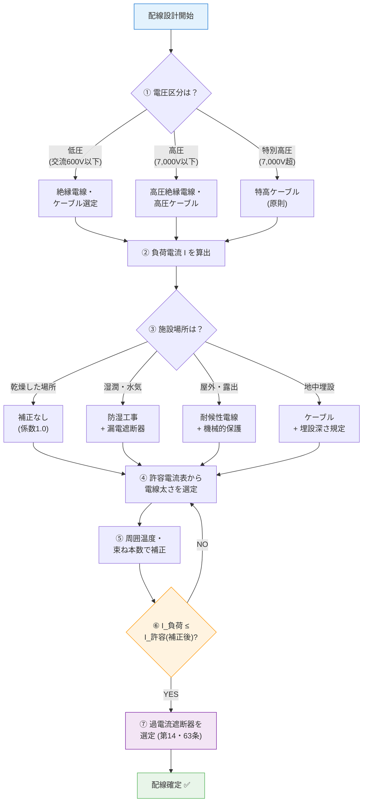

# 56-patch-1: 視覚要素3点

## 統合先と統合方法

### A1-① 配線3要素マトリクスSVG
**統合先**: section 6「ドメイン固有フレーム — 配線3要素」の冒頭、`> 第56条の判定軸を3要素に分解。試験ではこの3要素のいずれかを問われる。` の直後

**追加内容**:

<div><svg viewBox="0 0 700 300" xmlns="http://www.w3.org/2000/svg" font-family="sans-serif" font-size="12" style="width:100%;max-width:700px">
  <text x="350" y="22" text-anchor="middle" font-size="14" font-weight="bold" fill="#333">配線の3要素 — 第56条の判定軸</text>
  <!-- 中央：配線ハブ -->
  <circle cx="350" cy="155" r="48" fill="#e3f2fd" stroke="#1976d2" stroke-width="2"/>
  <text x="350" y="150" text-anchor="middle" font-size="14" font-weight="bold" fill="#0d47a1">配線</text>
  <text x="350" y="168" text-anchor="middle" font-size="10" fill="#0d47a1">（第56条）</text>
  <!-- 接続線 -->
  <line x1="312" y1="125" x2="180" y2="80" stroke="#1976d2" stroke-width="1.5"/>
  <line x1="350" y1="107" x2="350" y2="55" stroke="#1976d2" stroke-width="1.5"/>
  <line x1="388" y1="125" x2="520" y2="80" stroke="#1976d2" stroke-width="1.5"/>
  <line x1="350" y1="203" x2="350" y2="245" stroke="#1976d2" stroke-width="1.5" stroke-dasharray="3,3"/>
  <!-- 要素1：電圧 -->
  <rect x="50" y="55" width="180" height="65" rx="8" fill="#fff3e0" stroke="#ef6c00" stroke-width="1.5"/>
  <text x="140" y="76" text-anchor="middle" font-size="13" font-weight="bold" fill="#e65100">① 電圧</text>
  <text x="140" y="94" text-anchor="middle" font-size="10" fill="#bf360c">低圧 / 高圧 / 特高</text>
  <text x="140" y="110" text-anchor="middle" font-size="10" fill="#bf360c">→ 絶縁耐力で決まる</text>
  <!-- 要素2：電流容量 -->
  <rect x="260" y="20" width="180" height="65" rx="8" fill="#f3e5f5" stroke="#7b1fa2" stroke-width="1.5"/>
  <text x="350" y="41" text-anchor="middle" font-size="13" font-weight="bold" fill="#4a148c">② 電流容量</text>
  <text x="350" y="59" text-anchor="middle" font-size="10" fill="#4a148c">負荷電流 ≤ 許容電流</text>
  <text x="350" y="75" text-anchor="middle" font-size="10" fill="#4a148c">→ 電線太さで決まる</text>
  <!-- 要素3：施設場所 -->
  <rect x="470" y="55" width="180" height="65" rx="8" fill="#e8f5e9" stroke="#2e7d32" stroke-width="1.5"/>
  <text x="560" y="76" text-anchor="middle" font-size="13" font-weight="bold" fill="#1b5e20">③ 施設場所</text>
  <text x="560" y="94" text-anchor="middle" font-size="10" fill="#1b5e20">乾燥/湿潤/屋外/埋込</text>
  <text x="560" y="110" text-anchor="middle" font-size="10" fill="#1b5e20">→ 工事方法で決まる</text>
  <!-- 結論ボックス -->
  <rect x="200" y="245" width="300" height="42" rx="6" fill="#fffde7" stroke="#f9a825" stroke-width="1.5"/>
  <text x="350" y="263" text-anchor="middle" font-size="11" font-weight="bold" fill="#e65100">3要素すべてを満たす配線設計</text>
  <text x="350" y="279" text-anchor="middle" font-size="10" fill="#e65100">＝ 感電・火災のおそれがない状態</text>
</svg></div>

---

### A1-② 管内vs露出 温度比較SVG
**統合先**: section 7「数値実装表 — 環境補正」の `!!! example "環境による許容電流変化"` ブロックの直前

**追加内容**:

<div><svg viewBox="0 0 680 240" xmlns="http://www.w3.org/2000/svg" font-family="sans-serif" font-size="12" style="width:100%;max-width:680px">
  <text x="340" y="20" text-anchor="middle" font-size="13" font-weight="bold" fill="#333">露出配線（通風良好）vs 管内配線（通風遮断） — 同一電流での温度差</text>
  <!-- 左パネル：露出配線 -->
  <rect x="15" y="32" width="305" height="195" rx="8" fill="#f1f8e9" stroke="#66bb6a" stroke-width="1.5"/>
  <text x="167" y="52" text-anchor="middle" font-weight="bold" fill="#388e3c">露出配線（がいし引き等）</text>
  <!-- 電線断面：低温（青〜緑） -->
  <defs>
    <radialGradient id="cool" cx="50%" cy="50%" r="50%">
      <stop offset="0%" stop-color="#fdd835"/>
      <stop offset="60%" stop-color="#7cb342"/>
      <stop offset="100%" stop-color="#1976d2"/>
    </radialGradient>
    <radialGradient id="hot" cx="50%" cy="50%" r="50%">
      <stop offset="0%" stop-color="#ef5350"/>
      <stop offset="50%" stop-color="#ff8a65"/>
      <stop offset="100%" stop-color="#fdd835"/>
    </radialGradient>
  </defs>
  <circle cx="167" cy="125" r="42" fill="url(#cool)" stroke="#1565c0" stroke-width="1.5"/>
  <text x="167" y="129" text-anchor="middle" font-size="11" font-weight="bold" fill="#fff">電線</text>
  <!-- 放熱矢印（外向き） -->
  <line x1="167" y1="78" x2="167" y2="62" stroke="#0288d1" stroke-width="1.5" marker-end="url(#arrUp)"/>
  <line x1="214" y1="125" x2="232" y2="125" stroke="#0288d1" stroke-width="1.5" marker-end="url(#arrR)"/>
  <line x1="167" y1="172" x2="167" y2="188" stroke="#0288d1" stroke-width="1.5" marker-end="url(#arrD)"/>
  <line x1="120" y1="125" x2="102" y2="125" stroke="#0288d1" stroke-width="1.5" marker-end="url(#arrL)"/>
  <defs>
    <marker id="arrUp" markerWidth="6" markerHeight="6" refX="3" refY="6" orient="auto"><polygon points="0 6,3 0,6 6" fill="#0288d1"/></marker>
    <marker id="arrR" markerWidth="6" markerHeight="6" refX="6" refY="3" orient="auto"><polygon points="0 0,6 3,0 6" fill="#0288d1"/></marker>
    <marker id="arrD" markerWidth="6" markerHeight="6" refX="3" refY="0" orient="auto"><polygon points="0 0,3 6,6 0" fill="#0288d1"/></marker>
    <marker id="arrL" markerWidth="6" markerHeight="6" refX="0" refY="3" orient="auto"><polygon points="6 0,0 3,6 6" fill="#0288d1"/></marker>
  </defs>
  <text x="167" y="55" text-anchor="middle" font-size="9" fill="#0277bd">放熱</text>
  <!-- 結論 -->
  <rect x="40" y="195" width="255" height="22" rx="4" fill="#c8e6c9" stroke="#2e7d32"/>
  <text x="167" y="210" text-anchor="middle" font-size="11" font-weight="bold" fill="#1b5e20">ΔT 小 → 補正係数 100%</text>
  <!-- 右パネル：管内配線 -->
  <rect x="360" y="32" width="305" height="195" rx="8" fill="#fff3e0" stroke="#ef5350" stroke-width="1.5"/>
  <text x="512" y="52" text-anchor="middle" font-weight="bold" fill="#c62828">管内配線（金属管・合成樹脂管）</text>
  <!-- 管（外枠） -->
  <rect x="455" y="78" width="115" height="95" rx="6" fill="none" stroke="#6d4c41" stroke-width="2.5"/>
  <text x="512" y="73" text-anchor="middle" font-size="9" fill="#6d4c41">電線管（通風遮断）</text>
  <!-- 電線断面：高温（赤） -->
  <circle cx="512" cy="125" r="38" fill="url(#hot)" stroke="#c62828" stroke-width="1.5"/>
  <text x="512" y="129" text-anchor="middle" font-size="11" font-weight="bold" fill="#fff">電線</text>
  <!-- 放熱阻害（壁にぶつかる矢印） -->
  <line x1="512" y1="85" x2="512" y2="80" stroke="#c62828" stroke-width="1.5"/>
  <line x1="555" y1="125" x2="565" y2="125" stroke="#c62828" stroke-width="1.5"/>
  <line x1="512" y1="165" x2="512" y2="170" stroke="#c62828" stroke-width="1.5"/>
  <line x1="469" y1="125" x2="459" y2="125" stroke="#c62828" stroke-width="1.5"/>
  <text x="512" y="69" text-anchor="middle" font-size="9" fill="#c62828">熱がこもる</text>
  <!-- 結論 -->
  <rect x="385" y="195" width="255" height="22" rx="4" fill="#ffcdd2" stroke="#c62828"/>
  <text x="512" y="210" text-anchor="middle" font-size="11" font-weight="bold" fill="#b71c1c">ΔT 大 → 補正係数 約90%[要確認]</text>
</svg></div>

*補正係数の具体値は電技解釈第146条等に委任。最新値は eGov 公式で要確認。*

---

### A2 電線選定flowchart
**統合先**: section 8「設計フロー — 電線選定の6ステップ」の擬似コードブロック（```...```）の直後、`!!! tip "暗記のコツ"` の直前

**追加内容**:



---

## 統合後の整合性チェック

- [ ] section 6・7・8 のセクション番号は変わらない（追加のみ・番号維持）
- [ ] SVG・mermaid追加でセクション数は変わらない（既存の総セクション数を維持）→ ※56.mdの実セクション数は本パッチ未確認のため、適用時に `grep "^## [0-9]" 56.md` で確認すること
- [ ] [要確認] フラグは A1-② の「補正係数 約90%」キャプションのみ付与（電技解釈第146条の数値が eGov 未確認のため）
- [ ] A1-① と A1-② はオリジナル創作の概念図のため [要確認] 不要
- [ ] SVG2点とも `<div>` で囲み済み・空白行なし（CLAUDE.md 絶対ルール準拠）
- [ ] mermaid flowchart は擬似コードブロックの**直後**に追加（置き換えではない）
- [ ] § 記号は不使用、セクション番号は ① ② ③ または 1. 2. 表記
